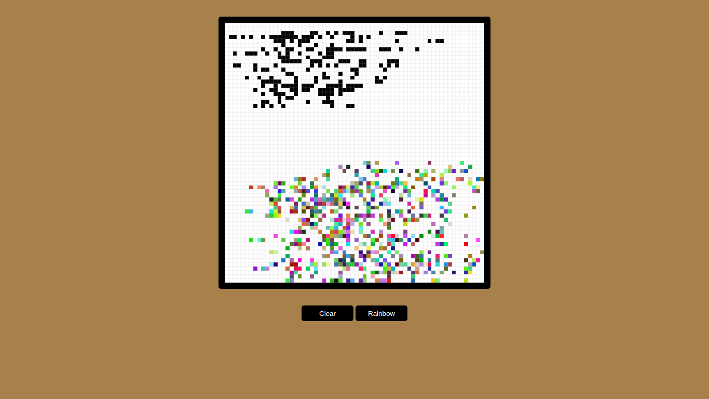

#  Etch-A-Sketch

This is a solution to the  [Etch-A-Sketch](https://www.theodinproject.com/lessons/foundations-etch-a-sketch) project challenge.

Users should be able to:

- Draw in the etch a sketch

# Built with

 
 
 

  
# What I learned

- Work with variables and strings
- Use DOM events and eventListeners
- Work with functions

# Screenshots

# Link

- You can see a demo here [Live site](https://agusscript.github.io/Etch-A-Sketch/)

# Author

- Linkedin - [Agustin Emanuel Sanchez](https://www.linkedin.com/in/agustin-emanuel-sanchez-4b2807240/)
- Frontend Mentor - [@agusscript](https://www.frontendmentor.io/profile/agusscript)
- CodePen - [Agustin Sanchez](https://codepen.io/agusscript)
- Twitter - [@agus_script](https://twitter.com/agus_script)

